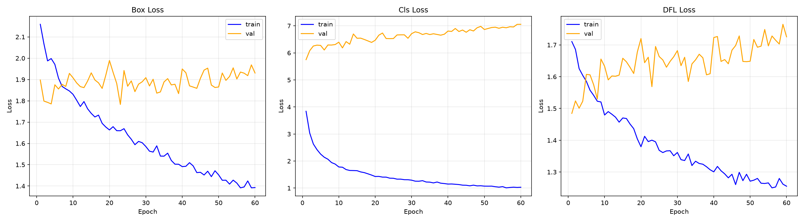
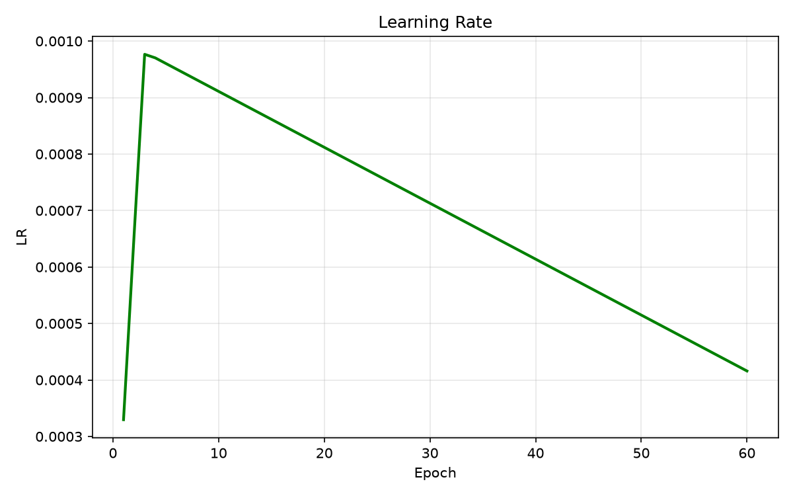
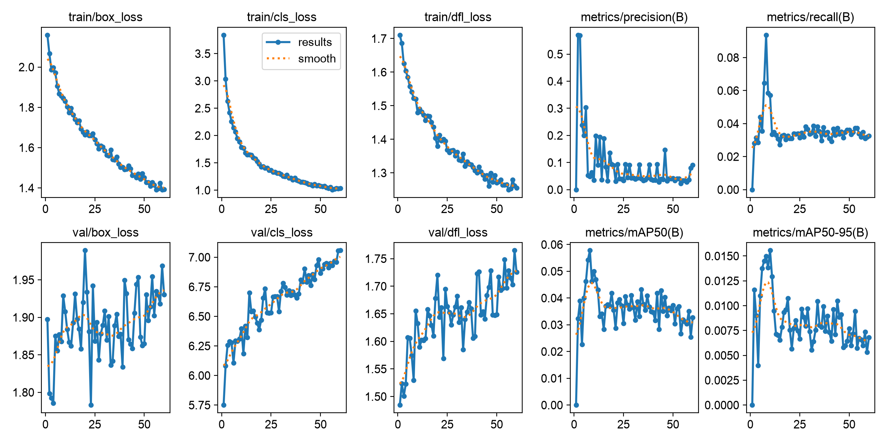
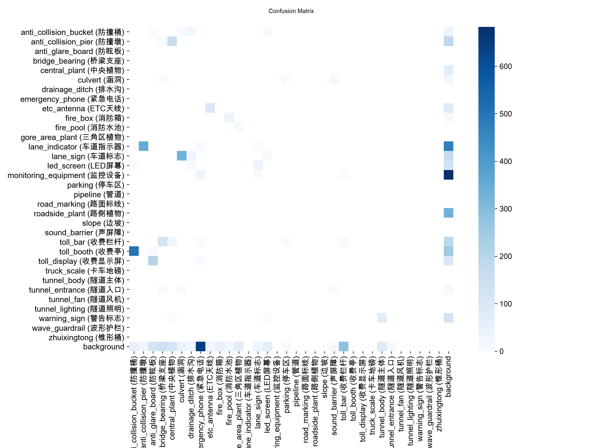
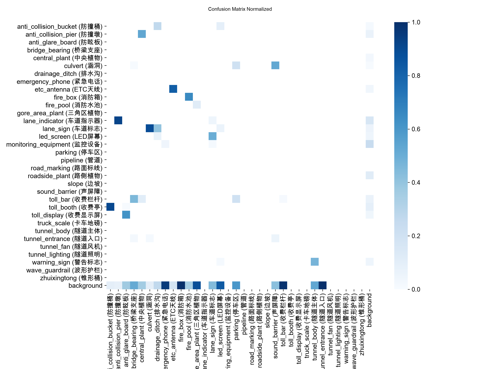
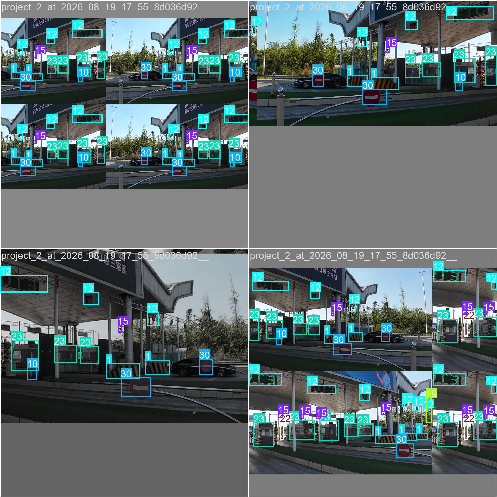
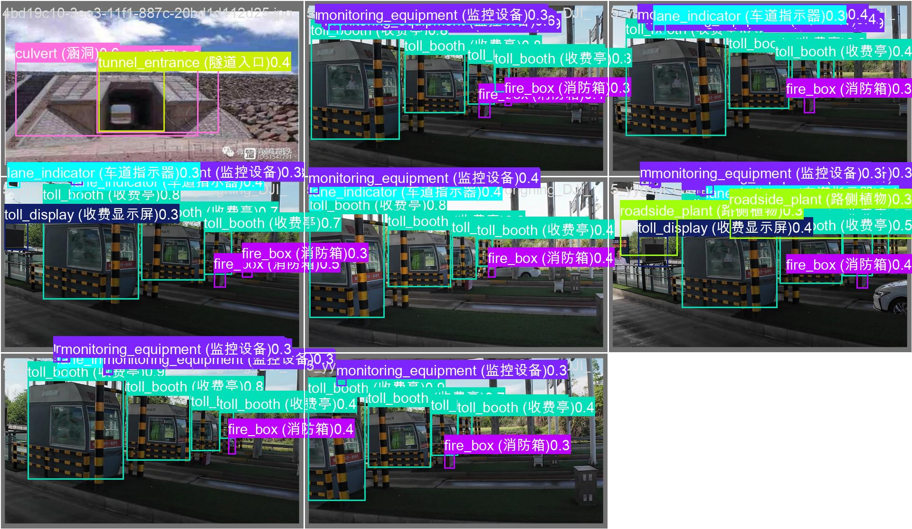

# YOLO 训练报告 #2

生成时间: 2026-08-19 21:31:58

## 1. 超参数配置

| 参数 | 值 |
|------|----|
| 预训练模型 | d:\实习\day19\code\test5\yolo11n.pt |
| 训练轮数 | 100 |
| 批大小 | 4 |
| 图像尺寸 | 960 |
| 设备 | 0 |
| 优化器 | AdamW |
| 初始学习率 | 0.001 |
| 最终学习率比例 | 0.01 |
| 早停轮数 | 50 |
| 数据加载线程 | 2 |

## 2. 训练时间

| 项目 | 值 |
|------|----|
| 总耗时 | 0:14:11 |

## 3. 评估指标

### 总体指标

| 指标 | 值 |
|------|----|
| mAP50-95 | 0.0156 |
| mAP50 | 0.0500 |
| mAP75 | 0.0036 |
| 精确率 (P) | 0.0362 |
| 召回率 (R) | 0.0580 |

### 各类别指标

| 类别 | 精确率 | 召回率 | mAP50 |
|------|--------|--------|-------|
| anti_collision_bucket (防撞桶) | 0.0000 | 0.0000 | 0.0001 |
| anti_collision_pier (防撞墩) | 0.0000 | 0.0000 | 0.0000 |
| anti_glare_board (防眩板) | 0.0000 | 0.0000 | 0.0000 |
| bridge_bearing (桥梁支座) | 0.0000 | 0.0000 | 0.0000 |
| central_plant (中央植物) | 0.1993 | 0.1033 | 0.0554 |
| culvert (涵洞) | 0.0344 | 0.0094 | 0.0173 |
| drainage_ditch (排水沟) | 0.0000 | 0.0000 | 0.0000 |
| emergency_phone (紧急电话) | 0.0000 | 0.0000 | 0.0000 |
| etc_antenna (ETC天线) | 0.3353 | 0.8387 | 0.6984 |
| fire_box (消防箱) | 0.0000 | 0.0000 | 0.0000 |
| fire_pool (消防水池) | 0.1041 | 0.0727 | 0.1747 |
| gore_area_plant (三角区植物) | 0.0000 | 0.0000 | 0.0000 |
| lane_indicator (车道指示器) | 0.0010 | 0.0294 | 0.0007 |
| lane_sign (车道标志) | 0.0000 | 0.0000 | 0.0008 |
| led_screen (LED屏幕) | 0.0000 | 0.0000 | 0.0000 |
| monitoring_equipment (监控设备) | 0.0000 | 0.0000 | 0.0000 |
| parking (停车区) | 0.0139 | 0.0490 | 0.0019 |
| pipeline (管道) | 0.0000 | 0.0000 | 0.0000 |
| road_marking (路面标线) | 0.0000 | 0.0000 | 0.0000 |
| roadside_plant (路侧植物) | N/A | N/A | N/A |
| slope (边坡) | N/A | N/A | N/A |
| sound_barrier (声屏障) | N/A | N/A | N/A |
| toll_bar (收费栏杆) | N/A | N/A | N/A |
| toll_booth (收费亭) | N/A | N/A | N/A |
| toll_display (收费显示屏) | N/A | N/A | N/A |
| truck_scale (卡车地磅) | N/A | N/A | N/A |
| tunnel_body (隧道主体) | N/A | N/A | N/A |
| tunnel_entrance (隧道入口) | N/A | N/A | N/A |
| tunnel_fan (隧道风机) | N/A | N/A | N/A |
| tunnel_lighting (隧道照明) | N/A | N/A | N/A |
| warning_sign (警告标志) | N/A | N/A | N/A |
| wave_guardrail (波形护栏) | N/A | N/A | N/A |
| zhuixingtong (锥形桶) | N/A | N/A | N/A |

## 4. 可视化图像

### 训练曲线

- 
- 
- 

### 评估图像

- 
- 
- 
- 
- 
- 

### 训练样本

- 
- 
